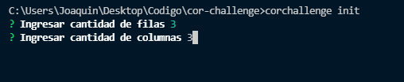
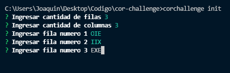
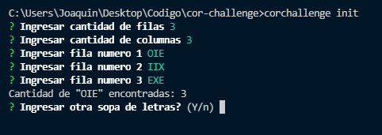

# cor-challenge

## Para iniciar la aplicación

1 - Instalar depedencias
```
$ npm install
```

2 - Instalar la aplicación
```
$ npm link
```

3 - Correr test del projecto 
```
$ npm run test o yarn test
```

4 - Inciar la aplicación
```
$ corchallenge init
```

## Para ingresar input la aplicación

le pedira al usuario ingresar la cantidad de filas y columnas <br>


luego debera ingresar el valor de las filas en mayuscula <br>


La aplicacion mostrara el resultado de la busqueda de la palabra "OIE" <br>

